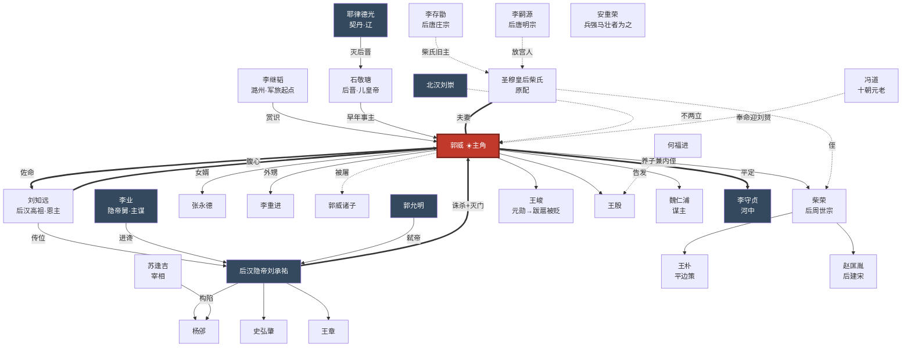

# 人物总图

> 以 [[郭威]] 为圆心的关系网络。每个名字都是一张可点开的双链人物卡。
> 返回 [[00-总览·阅读地图]]。

## 一、关系网络图

## 二、人物清单（按与郭威的关系分类）

### 主角
- [[郭威]]——后周太祖。孤儿、牙兵、刺青"郭雀儿"，终成开国天子。

### 恩主与君上（郭威向上看的人）
- [[李继韬]]——潞州留后，郭威军旅起点，赏其胆气。
- [[李存勖]]——后唐庄宗，郭威所隶亲军之主，亦柴氏旧主。
- [[李嗣源]]——后唐明宗，放宫人成就郭威姻缘。
- [[石敬瑭]]——后晋高祖，郭威早年事主，割燕云十六州者。
- [[刘知远]]——后汉高祖，郭威一生**恩主**，提携至枢密副使。
- [[后汉隐帝刘承祐]]——郭威受顾命所立少帝，后成**死敌**，灭其满门。

### 家族（郭威向内看的人）
- [[圣穆皇后柴氏]]——原配，原后唐庄宗嫔妃，贤而早逝，是郭威与柴荣的纽带。
- [[柴荣]]——养子兼内侄，后周世宗，因郭威亲子尽被屠而成第一继承人。
- [[张永德]]——女婿，殿前都点检。
- [[李重进]]——外甥，郭威临终命其向柴荣行君臣礼以定名分。
- [[郭威诸子]]——950 年乾祐之变中被屠尽，郭威断后之痛。

### 后汉权臣（同朝共事，先荣后死）
- [[杨邠]]——枢密使，主政事。
- [[史弘肇]]——侍卫亲军都指挥使，掌禁军，与郭威同掌兵柄。
- [[王章]]——三司使，掌财赋。

### 隐帝近幸（杀局的主谋与刽子手）
- [[苏逢吉]]——宰相，构陷火上浇油。
- [[李业]]——隐帝舅父，杀局核心。
- [[郭允明]]——茶酒使，弑隐帝者。

### 郭威班底（郭威向下识用的人）
- [[王峻]]——开国元勋、枢密使，后骄横跋扈被贬死。
- [[王殷]]——开国元勋、邺都留守，后被诛。
- [[魏仁浦]]——枢密院吏出身的谋主，郭威起兵的智囊。
- [[何福进]]——镇州节度使，告发王殷。
- [[王朴]]——世宗首席谋臣，《平边策》作者。
- [[赵匡胤]]——早年投郭威、柴荣麾下，后陈桥兵变代周建宋。

### 敌手
- [[李守贞]]——河中节度使，郭威凭平定其叛而崛起。
- [[北汉刘崇]]——刘知远之弟，建北汉与后周不两立。
- [[耶律德光]]——契丹（辽）太宗，灭后晋者，五代北方巨压。

### 时代坐标（不直接相识，但定义了郭威的世界）
- [[冯道]]——历仕十君的"长乐老"，乱世士大夫的极端样本。
- [[安重荣]]——喊出"天子宁有种邪？兵强马壮者为之"的节度使。

---

> 看完人物，去读 [[时代底层逻辑]] 和 [[郭威底层逻辑]]，理解这张网为什么这样长。
